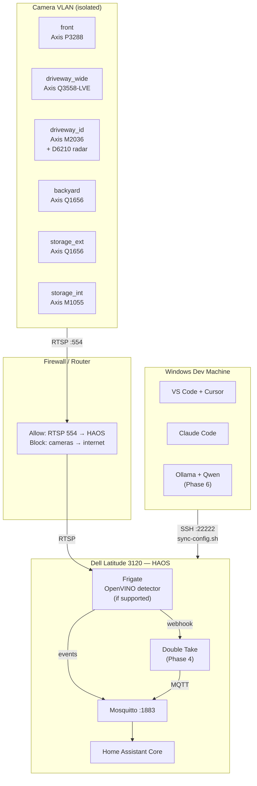

# Architecture Review — v1 Critique and Revised Design

Acting as a senior systems architect: honest assessment of the current design, identified weaknesses, and a revised v1 recommendation.

---

## What the Current Design Gets Right

- **Local-first**: No cloud APIs for security-critical paths. Good.
- **Add-on model (HAOS)**: Reduces operational overhead. Right call at this scale.
- **Config-as-code**: Repo + sync script establishes a maintainable pattern early.
- **Dual-stream per camera**: Separate detect and record streams is Frigate best practice. Correct.
- **ADRs**: Recording architectural decisions early prevents revisiting the same debates.
- **Zone-based naming**: Naming by location rather than hardware model is durable.

---

## Identified Weaknesses

### 1. No hardware acceleration for Frigate
**Risk:** The Dell Latitude 3120 has no dedicated GPU or Intel iGPU with OpenVINO support confirmed. Six cameras at even 5 FPS detect will stress a CPU-only detector. Detection lag increases, missed events increase.

**Mitigation options (in order of preference):**
1. Confirm whether the Latitude 3120's Intel CPU supports **OpenVINO** (most 10th-gen+ Intel CPUs do). If yes, enable in `frigate/config.yml` — this is a ~4× speedup over CPU mode, for free.
2. Add a Google Coral USB TPU (~€60). Single Coral handles 4–6 cameras comfortably.
3. Reduce detect FPS to 3 on cameras that matter less (`storage_int`).

**Action:** Check CPU model → confirm OpenVINO → document detector choice in ADR-003.

---

### 2. No network segmentation (cameras on same LAN as HA)
**Risk:** Axis cameras run a web server and RTSP with credentials in firmware. If one camera is compromised, it has LAN access to the HA host and all other devices.

**Mitigation:**
- Place all cameras on a dedicated IoT/camera VLAN
- Allow only RTSP (TCP 554) inbound from camera VLAN to HA host
- Block camera VLAN from accessing internet (Axis cameras don't need it for local use)

**Action:** Document VLAN design in `docs/architecture/network.md` before cameras go live.

---

### 3. CompreFace is underspecified
**Risk:** "Separate host or VM" is vague. If CompreFace runs on the HAOS host as a container, it competes with Frigate for CPU. If it runs on the Windows dev machine, it's only available when the PC is on.

**Recommended decision:** Run CompreFace as a **Docker container on a lightweight always-on host** (a Raspberry Pi 4 or the same Latitude 3120 in a separate Docker context, if HAOS allows custom containers via SSH workaround). Document this as ADR-003.

---

### 4. D6210 integration path is undefined
**Risk:** The D6210 radar sensor is connected via I/O port to the M2036. The integration method (VAPIX, ONVIF events, Axis MQTT) is TBD. Each has different schema and reliability tradeoffs.

**Recommended path:** Use **Axis MQTT** (available on firmware 10.12+). The D6210's motion events are published to the camera's MQTT channel. This is the same pipeline used in Phase 5 for other Axis analytics — consistent architecture.

**Action:** Verify M2036 firmware version. If < 10.12, plan firmware update before Phase 2.

---

### 5. No monitoring or alerting for the HA host itself
**Risk:** If the HAOS host goes down, you won't know until you notice automations not running. No uptime monitoring is defined.

**Mitigation:**
- Enable **HA watchdog** (built-in) for add-on restart on crash
- Add **uptime monitoring** via a lightweight external ping check (e.g. Better Uptime free tier, or a Raspberry Pi running UptimeKuma)
- Add the Operations dashboard view (already in design) with system health cards

---

### 6. Secrets management is manual
**Risk:** `secrets.yaml` is documented as "put it on the host manually." In practice, this means the secrets are undocumented and will be lost on a host wipe.

**Mitigation:**
- Store a **Bitwarden (or similar) secure note** with all secret values, referenced from the repo README
- Do NOT store secrets in git — the current approach is correct
- Document the restore procedure: "after a host wipe, re-create secrets.yaml from Bitwarden before running sync-config.sh"

---

### 7. Dashboard complexity ahead of data
**Risk:** The dashboard design references face recognition, AI, and Axis analytics sensors that don't exist yet. Building the full dashboard now will result in broken cards and maintenance drag.

**Recommendation:** Build dashboards in phases:
- Phase 2 complete → build Cameras + Security views only
- Phase 3 → add Rooms + Operations
- Phase 4 → add face recognition to Security view
- Phase 5 → add analytics sensors to Operations

---

## Revised v1 Architecture

This is what Phase 1+2 should look like — hardened, realistic, no future-state assumptions.

### Key changes from the initial design

| Change | Why |
|---|---|
| OpenVINO detector specified | CPU-only is a risk with 6 cameras — must resolve before Phase 2 |
| Camera VLAN added | Security hardening before cameras go live |
| CompreFace deferred to Phase 4 with host decision required | Can't be "TBD" — blocks face recognition planning |
| D6210 via Axis MQTT specified | Consistent with Phase 5 Axis analytics pipeline |
| Dashboard built in phases | Avoids broken cards from non-existent data |
| Secrets backup procedure required | Prevents lock-out after host failure |

---

## Immediate Actions (Before Phase 2)

1. **Identify CPU model** of the Dell Latitude 3120 and check OpenVINO compatibility
2. **Plan camera VLAN** — even a basic one before cameras go live
3. **Decide CompreFace hosting** — document as ADR-003
4. **Check M2036 firmware** — needs 10.12+ for Axis MQTT
5. **Set up secret backup** — Bitwarden or equivalent
