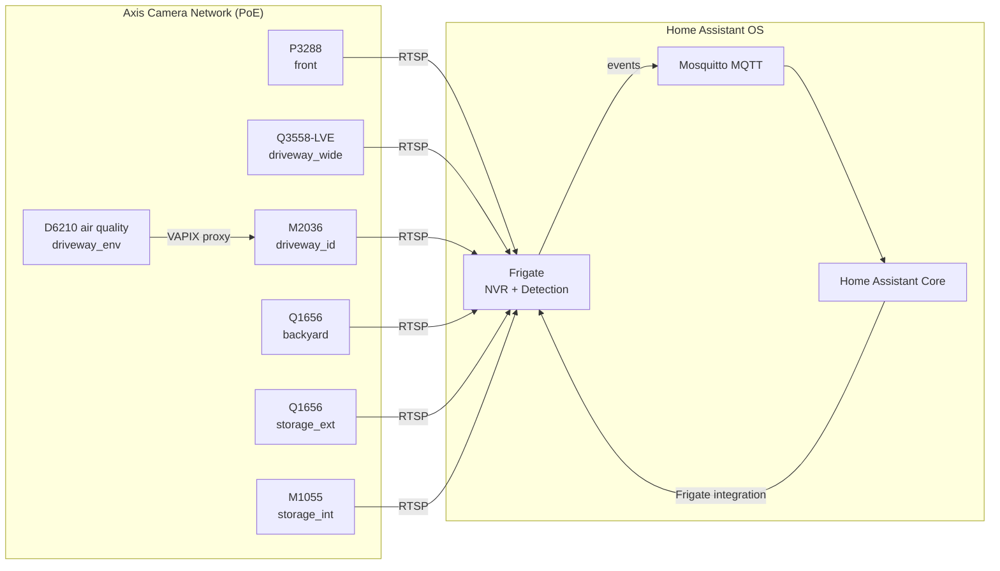
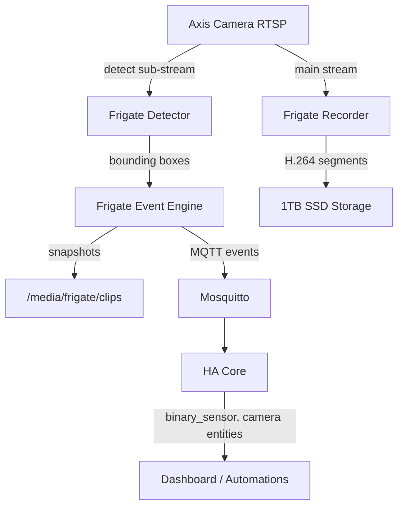
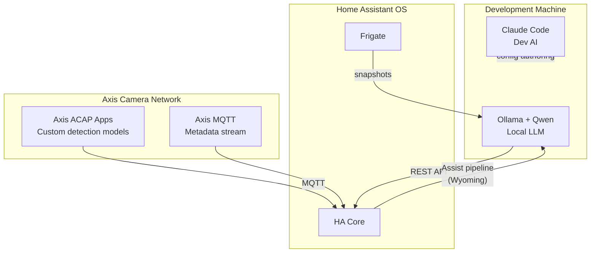

# System Architecture

## Production Environment

```
┌─────────────────────────────────────────────────────────┐
│  Dell Latitude 3120 — Home Assistant OS                 │
│                                                         │
│  ┌─────────────────┐   ┌─────────────────────────────┐ │
│  │  Home Assistant │   │  Frigate Add-on             │ │
│  │  Core           │◄──│  NVR + Object Detection     │ │
│  │  :8123          │   │  :5000 / :8554 (RTSP)       │ │
│  └────────┬────────┘   └──────────┬──────────────────┘ │
│           │ MQTT                  │ RTSP                │
│  ┌────────▼────────┐                                     │
│  │  Mosquitto      │                                     │
│  │  MQTT Broker    │                                     │
│  │  :1883          │                                     │
│  └────────┬────────┘                                     │
│           │                                             │
│  ┌────────▼────────────────────────────────────────┐   │
│  │  Danielsson Insights add-on v0.2.4              │   │
│  │  timeline :8765 · normalizer · bridges · Influx │   │
│  │  /share/danielsson-insights/events/             │   │
│  └─────────────────────────────────────────────────┘   │
│                                                         │
│  Storage: External 1 TB SSD  (Frigate recordings)       │
└─────────────────────────────────────────────────────────┘
              ▲ RTSP streams
┌─────────────────────────────────────────────────────────┐
│  Axis Camera Network (PoE)                              │
│  P3288  Q3558-LVE  M2036  Q1656×2  M1055  D6210        │
└─────────────────────────────────────────────────────────┘
```

## Development Environment

```
┌──────────────────────────────────────────────────┐
│  Windows PC — Development Machine                │
│                                                  │
│  VS Code + Cursor  ──►  config/ (this repo)      │
│  Claude Code       ──►  AI-assisted development  │
│  Ollama + Qwen     ──►  Local LLM (planned)      │
│                                                  │
│  scripts/sync-config.sh ──SSH──► HAOS :22222     │
└──────────────────────────────────────────────────┘
```

---

## Camera Architecture



---

## Frigate Architecture



**Dual-stream per camera:**
- **Detect stream** — sub-resolution (e.g. 640×360), low FPS, feeds the ML detector
- **Record stream** — full resolution, continuous or motion-triggered recording to SSD

---

## Current Detection Stack

| Camera | Detect Resolution | Detect FPS | Objects |
|---|---|---|---|
| front | 640×360 | 5 | person, face |
| driveway_wide | 1280×720 | 5 | person, car |
| driveway_id | 640×360 | 10 | person, face, car |
| backyard | 640×360 | 5 | person |
| storage_ext | 640×360 | 5 | person |
| storage_int | 640×360 | 5 | person |

---

## Outdoor Presence (current)

Entry-zone camera analytics fused into a single HA binary sensor:

- `binary_sensor.house_outdoor_presence` — from Frigate person, AOA PersonOccupancy, and scene presence at `front`, `driveway_wide`, `driveway_id`
- Template: `config/home-assistant/templates/house_context.yaml`

Face recognition and family Companion presence were removed — [ADR-006](../decisions/006-no-face-no-companion-presence.md).

---

## AI Integration Architecture (Planned)



**Phases:**
1. Axis ACAP analytics → MQTT → HA (metadata enrichment)
2. Ollama LLM → HA Assist pipeline (natural language automations)
3. Vision-language model (LLaVA/Qwen-VL) → scene descriptions on events
4. AI agent loop: event → context → decision → HA action

---

## Network Topology

See [network.md](network.md) for IP assignments, VLAN design, and port table.

## Data Flows

See [data-flows.md](data-flows.md) for detailed per-integration data flow documentation.
